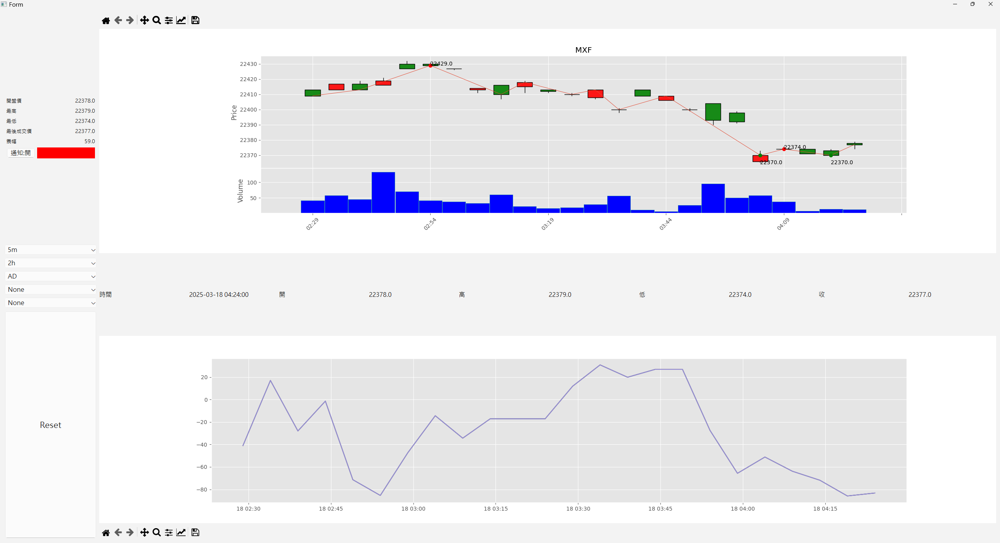

# 轉折點看盤工具 (Turning Point Stock Chart Tool)

轉折點看盤工具 is a Python-based stock analysis application with a graphical interface built using PyQt. Developed as a freelance project (contracted for NT$5,000) and collaboratively implemented by **Hsiang-I, Lung** and **Vincent, Tsai**, this tool is designed to fetch and display real-time stock information along with technical indicators. It showcases skills in Python programming, GUI development, web crawling, and data visualization—capabilities highly relevant for advanced business analytics.

---

## Project Overview

The main objective of this tool is to provide users with an easy-to-use interface to monitor stock information and apply technical analysis. The application allows users to:

- **Configure a list of stock symbols:**  
  Input at least 10 stock codes (up to 100, subject to system performance).

- **Display essential stock data:**  
  - Yesterday’s closing price  
  - Today’s opening price  
  - Limit up (漲停價) and limit down (跌停價) prices  
  - Current stock price, price change, percentage change, and amplitude (振幅)  
  - Data retrieval timestamp

- **Select various time intervals for analysis:**  
  Options include 1 minute, 5 minutes, 15 minutes, 30 minutes, 60 minutes, daily, weekly, and monthly.

- **Choose technical indicators for visualization:**  
  Using **TA-Lib**, the tool supports a variety of financial indicators such as RSI, MACD, Bollinger Bands, Stochastic Oscillator, and a custom “turning point” method (similar to 寶塔線). Users can display at least three (up to five) indicators via line charts.
- **Refresh data on demand:**  
  Refresh buttons located at both the top and bottom of the interface allow users to update the displayed information and charts.

---
## Example Screenshot

Below is a sample screenshot of the interface:

*Description: The upper chart shows candlesticks and volume, and the lower chart shows a technical indicator.*

---
## Features

- **Configurable Stock List:**  
  Manage a list of stock codes (minimum 10, up to 100).

- **Comprehensive Stock Data Display:**  
  Automatically fetches and displays key stock metrics such as previous close, today’s open, limit up/down prices, current price, price change, amplitude, and the data timestamp.

- **Flexible Time Intervals:**  
  Supports multiple time intervals from 1-minute to monthly data.

- **Robust Technical Analysis with TA-Lib:**  
  - Incorporates TA-Lib to offer popular indicators like RSI, MACD, Bollinger Bands, Stochastic, and more.  
  - Includes a custom turning point indicator to highlight market inflection points.

- **User-Friendly Interface:**  
  Developed with PyQt, the GUI offers clear presentation and simple interaction:
  - Separate windows for stock and futures analysis.
  - Refresh buttons for on-demand data updates.

---

## Code Structure

The repository is organized as follows:

    firstjob/
    ├── .qt_for_python/                  # Auto-generated PyQt files
    ├── .vscode/                         # VS Code configuration files
    ├── __pycache__/                     # Cached Python bytecode
    ├── CrawlerClass.py                  # Web crawling logic to fetch stock data
    ├── MainUi.py                        # Main user interface layout module
    ├── MainUi_controller.py             # Controller for main UI event handling
    ├── MyWidget.py                      # Custom widget implementations
    ├── futuresWindowUi.py               # Module for futures window functionality
    ├── futuresWindowUi.ui               # Qt Designer file for futures window UI
    ├── futuresWindowUi_controller.py    # Controller for futures window events
    ├── mainUI.ui                        # Qt Designer file for the main UI layout
    ├── start.py                         # Entry point to launch the application
    ├── stockWindowUi.py                 # Module for stock window functionality
    ├── stockWindowUi.ui                 # Qt Designer file for stock window UI
    ├── stockWindowUi_controller.py      # Controller for stock window events
    ├── test.py                          # Test script for development/debugging
    └── favorite.json                    # JSON file for storing user preferences (e.g., favorite stocks)

- **CrawlerClass.py:** Handles web crawling to retrieve real-time stock data.  
- **MainUi.py & MainUi_controller.py:** Define and control the main application interface.  
- **stockWindowUi/** and **futuresWindowUi/**: Manage the UI and logic for displaying stock and futures data, respectively.  
- **start.py:** The main entry point to launch the application.

---

## Future Improvements

- **Data Caching:**  
  Enhance performance by implementing caching mechanisms for faster data retrieval.
- **Interactive Dashboard:**  
  Consider developing a more dynamic dashboard for real-time monitoring and customization.
- **Error Handling & Logging:**  
  Improve robustness with better error handling and logging features.

---

## Final Note
This repository does not include the compiled .exe to prevent unauthorized usage. The final product was privately delivered to the client. All code here is provided strictly as a demonstration of technical and analytical capabilities.
